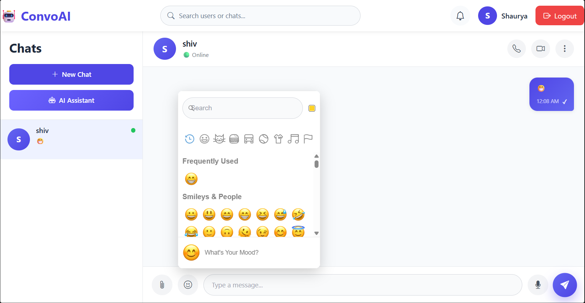

# 💬 ConvoAI – Real-Time Chat Application with Gemini AI

ConvoAI is a full-stack real-time chat application that enables users to communicate instantly through one-to-one messaging while leveraging Google's Gemini AI for intelligent assistance. The application supports secure authentication, real-time communication using Socket.IO, AI-powered conversations, file sharing, online status tracking, typing indicators, and a modern responsive interface.

---

## 🚀 Features

### 👤 User Authentication
- Secure JWT-based authentication
- User Registration & Login
- Password hashing using bcrypt
- Protected routes

### 💬 Real-Time Chat
- One-to-one messaging
- Instant message delivery using Socket.IO
- Typing indicator
- Online / Offline status
- Message timestamps

### 🤖 Gemini AI Assistant
- AI-powered chat assistant
- Ask programming questions
- Explain concepts
- Generate responses using Google Gemini API

### 📁 File Sharing
- Upload files
- Send documents
- Image sharing
- File preview support

### 🎨 User Interface
- Responsive design
- Modern chat layout
- Sidebar with conversations
- Search functionality
- AI Assistant panel
- Clean and intuitive interface

### 🔒 Security
- JWT Authentication
- Protected APIs
- Password encryption
- Environment variable protection

---

# 🛠 Tech Stack

## Frontend

- React.js
- Vite
- CSS3
- Axios
- React Router DOM
- Socket.IO Client
- Bootstrap Icons

## Backend

- Node.js
- Express.js
- MongoDB
- Mongoose
- Socket.IO
- JWT
- bcryptjs
- Multer
- Google Gemini API

## Database

- MongoDB Atlas

## AI

- Google Gemini API

---

# 📂 Project Structure

```
ConvoAI
│
├── frontend
│   ├── src
│   │   ├── assets
│   │   ├── components
│   │   ├── context
│   │   ├── pages
│   │   ├── services
│   │   ├── routes
│   │   └── App.jsx
│   └── package.json
│
├── backend
│   ├── config
│   ├── controllers
│   ├── middleware
│   ├── models
│   ├── routes
│   ├── services
│   ├── socket
│   ├── uploads
│   ├── server.js
│   └── package.json
│
└── README.md
```

---

# ⚙️ Installation

## Clone Repository

```bash
git clone https://github.com/Shaurya2607/ConvoAI.git
```

```
cd ConvoAI
```

---

## Backend Setup

```
cd backend
npm install
```

Create a `.env` file:

```env
PORT=5000

MONGO_URI=your_mongodb_atlas_connection_string

JWT_SECRET=your_jwt_secret

GEMINI_API_KEY=your_gemini_api_key

NODE_ENV=development
```

Run Backend

```bash
npm run dev
```

---

## Frontend Setup

```
cd frontend
npm install
```

Create `.env`

```env
VITE_API_URL=http://localhost:5000/api
```

Run Frontend

```bash
npm run dev
```

---

# 🌐 Deployment

### Frontend

- Vercel

### Backend

- Render

### Database

- MongoDB Atlas

---

# 📸 Screenshots




---

# 🔮 Future Improvements

- Group Chats
- Video Calling
- Voice Calling
- Voice Messages
- Message Reactions
- Read Receipts
- Push Notifications
- Emoji Picker
- Message Search
- Chat Backup
- End-to-End Encryption

---

# 👨‍💻 Author

**Shaurya Gangwar**

GitHub:
https://github.com/Shaurya2607

LinkedIn:
https://linkedin.com/in/shaurya-gangwar-099651323

---

# 📜 License

This project is developed for learning, portfolio, and placement purposes.
